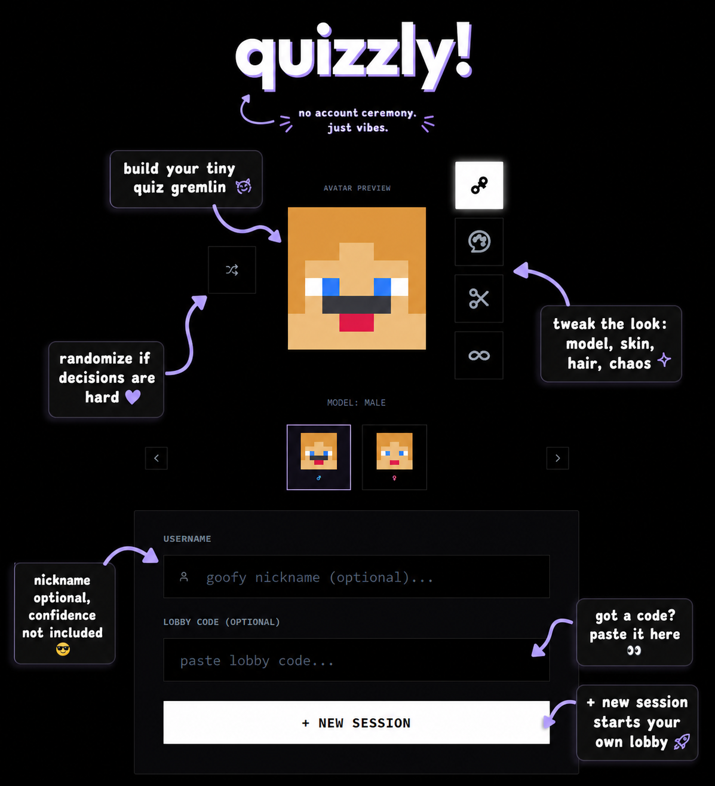
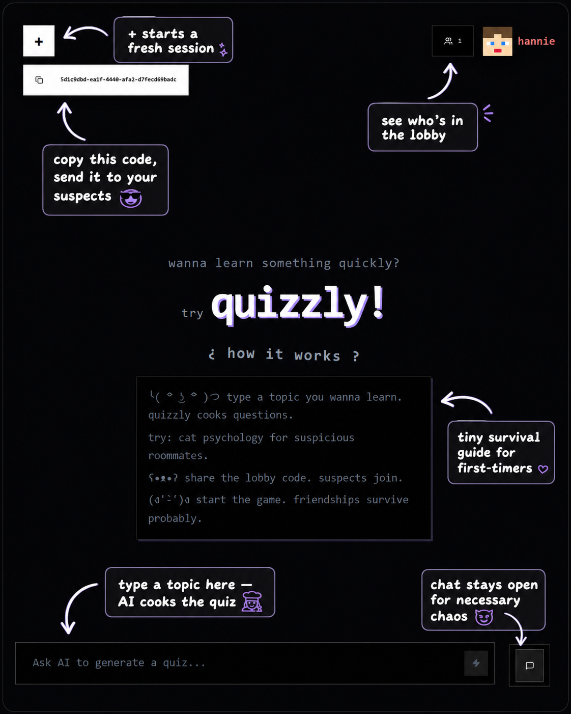
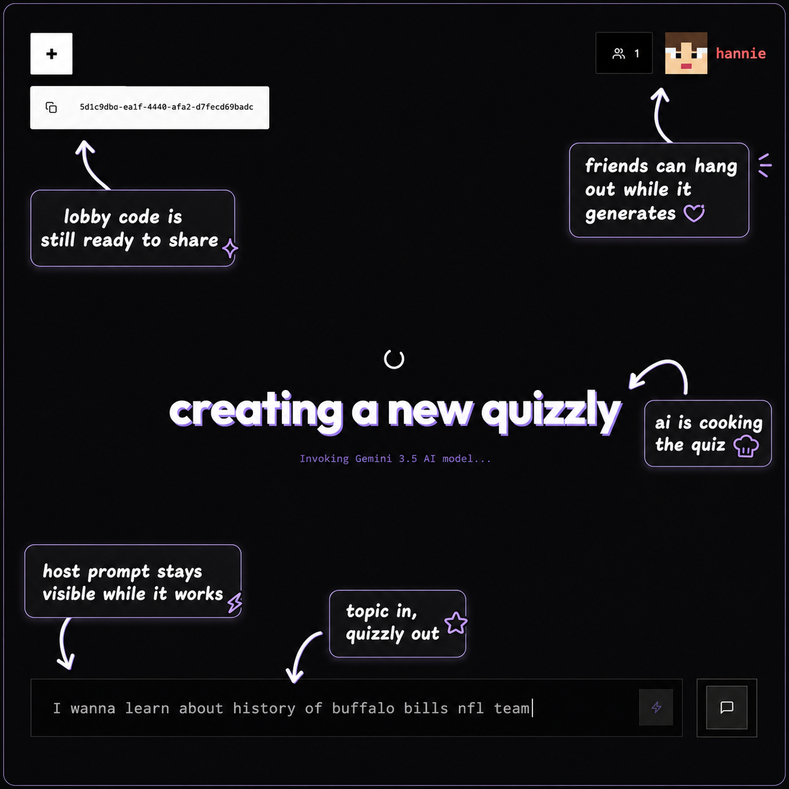
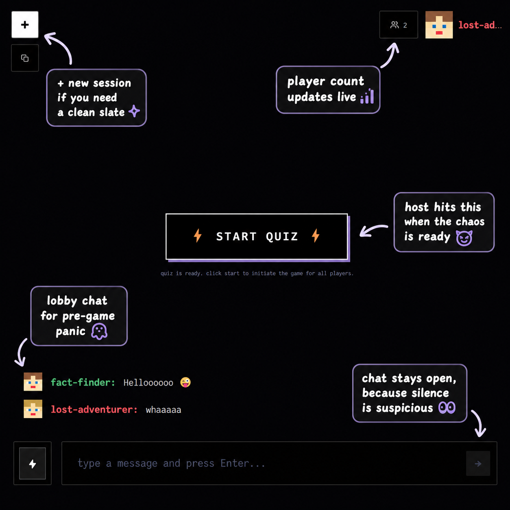
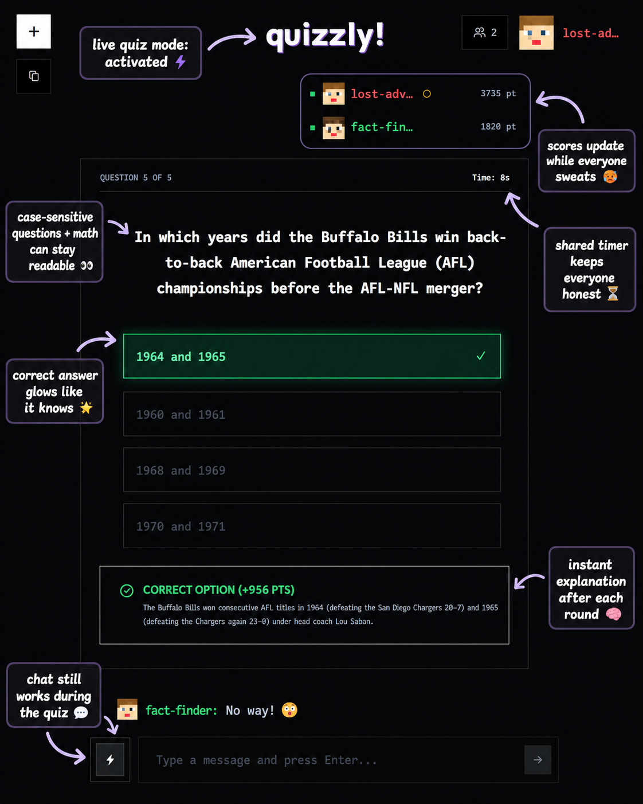
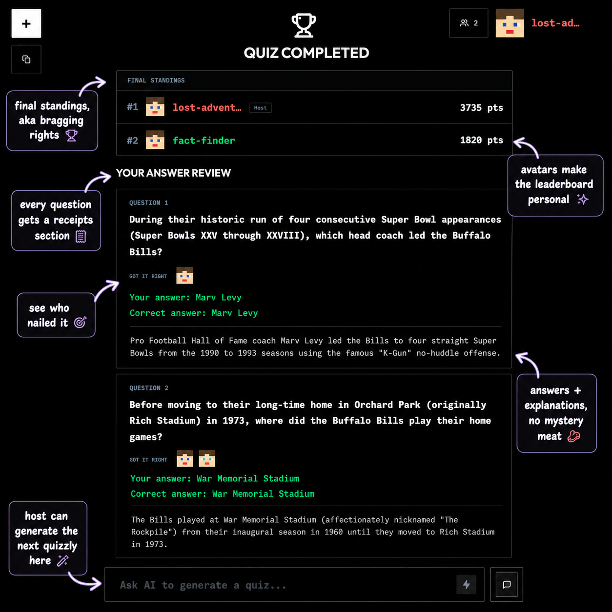

# Quizzly!

> Tiny lobby. Big quiz energy. Zero studying. Maximum suspicion.

Quizzly is a real-time multiplayer quiz app where one person types a prompt, AI cooks up a quiz, and everyone else tries to look smarter than they are.

No serious onboarding ceremony. No "please verify your soul by email." Just pick a blocky little character, enter a nickname, share a lobby code, and start causing educational damage.

```text
host: "make a quiz about black holes"
                 |
                 v
        AI starts cooking
                 |
                 v
guest 1: "easy"
guest 2: "what is gravity again"
guest 3: answers in 0.4 seconds, terrifying everyone
```

## What it does

Quizzly lets a host create a live quiz from a topic or document. Guests join with a lobby code, chat during the session, answer timed questions, and get a final breakdown at the end.

The app handles:

- AI-generated questions, answers, explanations, and visual themes
- Real-time multiplayer lobbies
- Guest and host roles
- Synchronized timers
- Live chat
- Player avatars
- Scoreboards
- Final answer summaries
- Host disconnects, because humans close tabs like raccoons in a kitchen

## The vibe

It is part quiz game, part study tool, part "wait, why did Alex get that right?"

The design is intentionally sharp, square, and a little arcade-ish. Players float around with custom blocky avatars. Chat messages drift in like tiny heckles. The host controls the quiz prompt. Guests can watch, answer, and talk trash responsibly.

## Screenshots

Tiny tour of the quizzly chaos:













## How a session works

1. Someone creates a new session.
2. Quizzly gives them a lobby code.
3. Friends join with the code.
4. The host prompts AI for a quiz.
5. Guests wait while the host summons the quizzly.
6. The host starts the game.
7. Everyone answers timed questions.
8. Correct answers glow green. Wrong answers get exposed in red. No answer means no answer, not fake-wrong nonsense.
9. The game auto-advances.
10. At the end, everyone sees a summary with answers, explanations, and who got each question right.

Clean. Mildly chaotic. Educational if you squint.

## The moving parts

Quizzly is split into three main services:

- `frontend/`  
  The Next.js app. This is the face of the operation: lobby screens, avatars, prompt/chat controls, quiz UI, summaries, KaTeX math rendering, and all the floaty square drama.

- `backend/`  
  The Express + Socket.IO server. This is the referee. It owns the realtime lobby state, player presence, timers, scoring, chat broadcasts, host forfeits, and game progression.

- `ai-service/`  
  The FastAPI worker. This is where prompts and documents go in, and Gemini returns questions, options, explanations, and theme data.

There is also Prisma/MySQL underneath keeping track of users, sessions, participants, questions, scores, and avatar choices.

## Multiplayer behavior

The backend is authoritative, meaning the browser does not get to invent scores or timers. Very important. Browsers are liars.

The server handles:

- who is in the lobby
- who is host
- who is online/offline
- who answered
- when the timer ends
- when the next question starts
- when the host has abandoned the ship

If the host disappears, Quizzly gives them a short grace period. If they do not return, the session closes and everyone gets the "host has forfeited" treatment. Dramatic, but fair.

## AI quiz generation

The host can ask for almost anything:

- "JavaScript closures"
- "World War II causes"
- "biology cell division"
- "make me suffer with calculus"

The AI service turns that into multiple-choice questions with explanations. It also preserves case-sensitive text and supports math formatting, because questions about `className`, `ClassName`, and `CLASSNAME` should not become a typographic crime scene.

## Characters

Players get little blocky avatars with customizable options like model, skin tone, hair, and facial hair. It is not a full RPG character creator. It is more like "Minecraft passport photo, but make it quiz night."

The avatars show up in the lobby, chat, leaderboard, and final summary so everyone knows exactly which tiny square-headed scholar got the answer right.

## Cloud shape

Quizzly is built to live in the cloud:

- the frontend runs as the public web app
- the backend runs as the realtime Socket.IO service
- the AI service runs separately as the quiz-generation worker
- the database stores the boring-but-important truth

The browser talks to the backend for realtime lobby/game/chat events, and the host triggers the AI service when creating a new quizzly.

## Repository map

```text
quizly/
├── frontend/       Next.js app, UI, avatars, chat, quiz screens
├── backend/        Express + Socket.IO realtime game server
├── ai-service/     FastAPI + Gemini quiz generator
├── prisma/         Shared-ish database schema land
└── docker-compose.yml
```

## Current status

Quizzly is still being shaped, polished, poked, and occasionally yelled at. The core idea is alive: fast AI-generated multiplayer quizzes with a lobby code and enough personality to make studying feel less like a tax form.

Bring friends. Bring guesses. Bring humility.

Someone is about to confidently choose the wrong answer.
